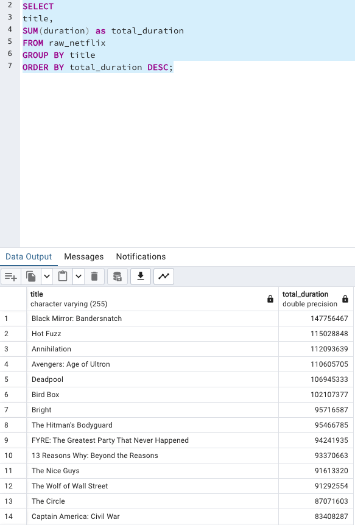

### Number of viewings

>This is a count of how many times a movie has been viewed.

I first used this SQL query to count the total views group by the title and order id by most views as I thought that would be more useful when understanding this dataset, when looking at the most popular titles.

```sql
SELECT
title,
COUNT(*) as total_views
FROM raw_netflix
GROUP BY title
ORDER BY total_views DESC;
```


After I tested the above query works, I added the syntax to create the view:

```sql
CREATE VIEW no_of_viewings AS
SELECT
title,
COUNT(*) as total_views
FROM raw_netflix
GROUP BY title
ORDER BY total_views DESC;
```


### Total viewing time

>This is the sum of the duration of all viewings of a particular movie.

I used the SUM clause to calculate the total duration of each title and thought again, ordering by the highest duration would make more sense in case people wanted to know which title had the most spent time.

```sql
SELECT
title,
SUM(duration) as total_duration
FROM raw_netflix
GROUP BY title
ORDER BY total_duration DESC;
```



Next I added the CREATE VIEW syntax to create this view:

```sql
CREATE VIEW total_viewing_time AS
SELECT
title,
SUM(duration) as total_duration
FROM raw_netflix
GROUP BY title
ORDER BY total_duration DESC;
```


### Average viewing duration of popular movies

>This is the average duration of the movies with the most views.

I used the AVG clause this time to retrieve the avg duration for each title and I used the CAST and ROUND function to return the value in 2 decimal places:

```sql
SELECT
title,
ROUND(CAST(AVG(duration) AS NUMERIC), 2) as avg_duration
FROM raw_netflix
GROUP BY title
ORDER BY avg_duration DESC;
```


Then I added the CREATE VIEW syntax to create the view:

```sql
CREATE VIEW avg_viewing_time AS
SELECT
title,
ROUND(CAST(AVG(duration) AS NUMERIC), 2) as avg_duration
FROM raw_netflix
GROUP BY title
ORDER BY avg_duration DESC;
```


### Number of unique viewers

>This is a count of how many unique users have viewed a particular movie.

First to find the unique user ids, I had to use the DISTINCT clause on the column user_id. Then I use the COUNT clause to count how many unique user ids there are with the following sql query:

```sql
SELECT 
COUNT(DISTINCT(user_id)) AS total_unique_users
FROM 
raw_netflix;
```


Finally, I created a view by adding the CREATE VIEW syntax:

```sql
SELECT 
COUNT(DISTINCT(user_id)) AS total_unique_users
FROM 
raw_netflix;
```


### User engagement

>This measure could be calculated in various ways, such as the number of movies each user has viewed, the frequency of each user's viewings, or the total viewing time per user.

To look at the engagement for each user, I thought calculate the total viewing time and the unique no of titles they have viewed on netflix would be helpful as suggested by the challenge. So in order to get the unique no titles viewed by each user, I used the DISTINCT clause first to return the unique titles each user viewed and then COUNT how many titles there are.

```sql
SELECT 
DISTINCT(user_id),
COUNT(DISTINCT(title)) AS total_titles,
SUM(duration) AS total_duration
FROM 
raw_netflix
GROUP BY user_id;
```


I did notice from the output there are some unsanitised data where -1 does not make sense for total_duration.

After this I added the CREATE VIEW syntax to create the view.

```sql
CREATE VIEW user_engagement AS
SELECT 
DISTINCT(user_id),
COUNT(DISTINCT(title)) AS total_titles,
SUM(duration) AS total_duration
FROM 
raw_netflix
GROUP BY user_id;

```
